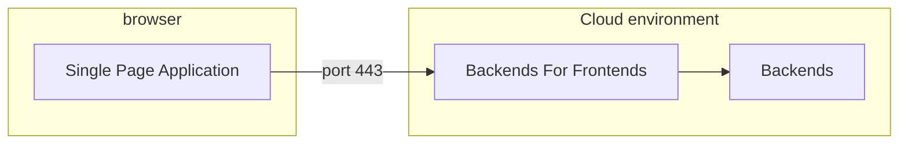

```mermaid
graph LR
  SPA["Single Page Application"]
  BFF["Backends For Frontends"]
  BE["Backends"]
  subgraph browser
    SPA
  end
  subgraph cloud["Cloud environment"]
    BFF --> BE
  end
  SPA -- port 443 --> BFF
```
