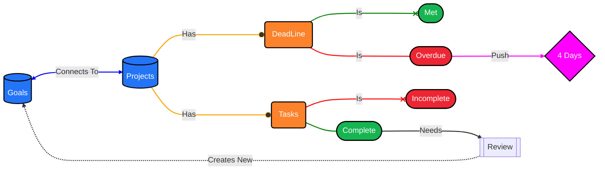
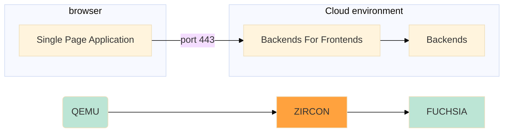
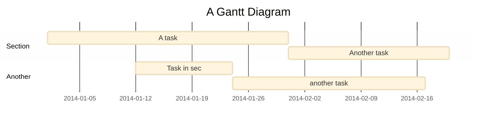
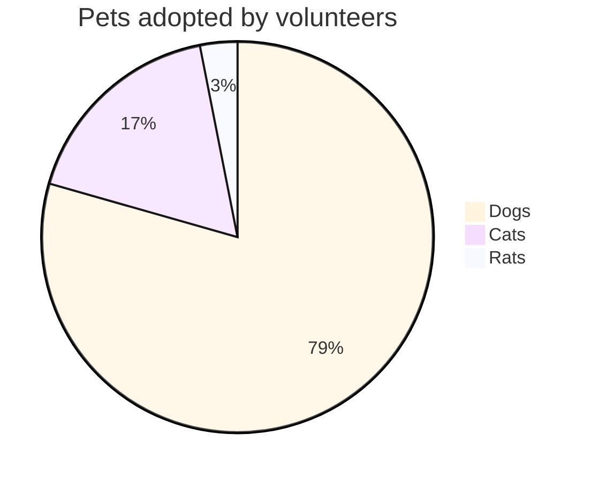
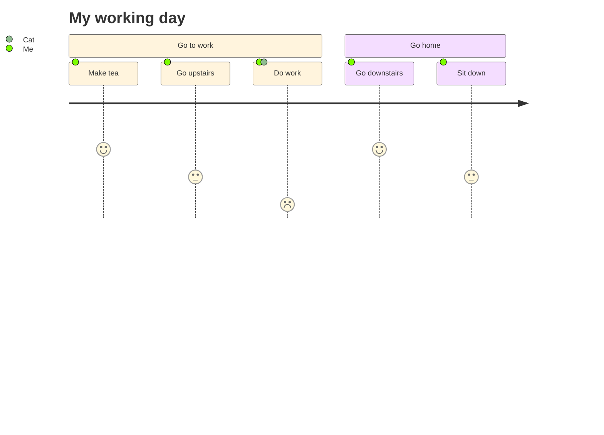

```mermaid
flowchart LR

%% Colors %%
linkStyle default stroke-width:2px
classDef blue fill:#2374f7,stroke:#000,stroke-width:2px,color:#fff
classDef orange fill:#fc822b,stroke:#000,stroke-width:2px,color:#fff
classDef green fill:#16b552,stroke:#000,stroke-width:2px,color:#fff
classDef red fill:#ed2633,stroke:#000,stroke-width:2px,color:#fff
classDef magenta fill:magenta,stroke:#000,stroke-width:2px,color:#fff

%% Goals Database%%
%% 0 %%
G[(Goals)]:::blue <===> |Connects To| P[(Projects)]:::blue

%% Projects Database%%
%% Deadline %%
%% 1,2,3,4 %%
P ---o |Has| PD(DeadLine):::orange
PD ---x|Is| MT([Met]):::green
PD ----|Is| OV([Overdue]):::red ---> |Push|FOV{4 Days}:::magenta


%% Tasks %%
%% 5,6,7,8 %%
P ---o |Has| PT(Tasks):::orange
PT ---x |Is| IC([Incomplete]):::red
PT --- C([Complete]):::green
C ---> |Needs| R[[Review]]

%% Review %%
%% 9 %%
R -..->|Creates New| G

%% Link Colors %%
linkStyle 0 stroke:blue
linkStyle 1,5 stroke:orange
linkStyle 2,7 stroke:green
linkStyle 3,6 stroke:red
linkStyle 4 stroke:magenta

%% Clickable Links %%
click P "https://www.google.co.jp"


```

```mermaid
%%{init:{'theme':'base'}}%%
  
graph LR
  SPA["Single Page Application"]
  BFF["Backends For Frontends"]
  BE["Backends"]
  subgraph browser
    SPA
  end
  subgraph cloud["Cloud environment"]
    BFF --> BE
  end
  SPA -- port 443 --> BFF
  

  classDef class1 fill:#7BCCAC,fill-opacity:0.5
  classDef class2 fill:#ffa23e

  qemu(QEMU):::class1 --> zircon[ZIRCON]:::class2
  zircon --> fuchsia[FUCHSIA]:::class1
```

```mermaid
%%{init:{'theme':'base'}}%%
 gantt
    title A Gantt Diagram
    dateFormat  YYYY-MM-DD
    section Section
    A task           :a1, 2014-01-01, 30d
    Another task     :after a1  , 20d
    section Another
    Task in sec      :2014-01-12  , 12d
    another task      : 24d
```

```mermaid
%%{init:{'theme':'base'}}%%
pie title Pets adopted by volunteers
    "Dogs" : 386
    "Cats" : 85
    "Rats" : 15
```

```mermaid
%%{init:{'theme':'base'}}%%
  journey
    title My working day
    section Go to work
      Make tea: 5: Me
      Go upstairs: 3: Me
      Do work: 1: Me, Cat
    section Go home
      Go downstairs: 5: Me
      Sit down: 3: Me
```      
